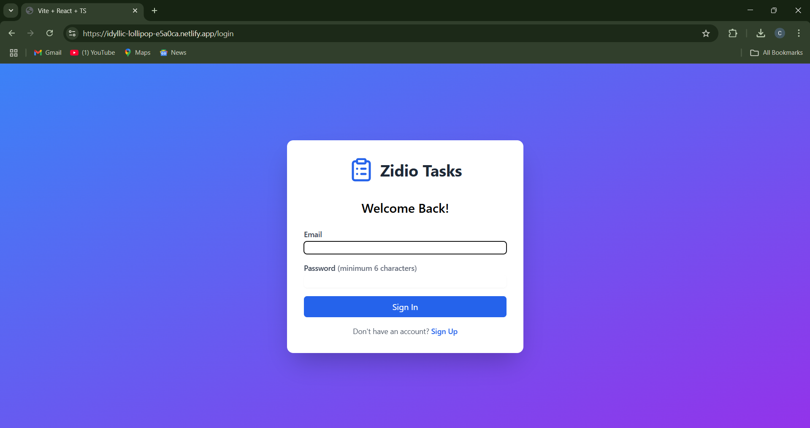
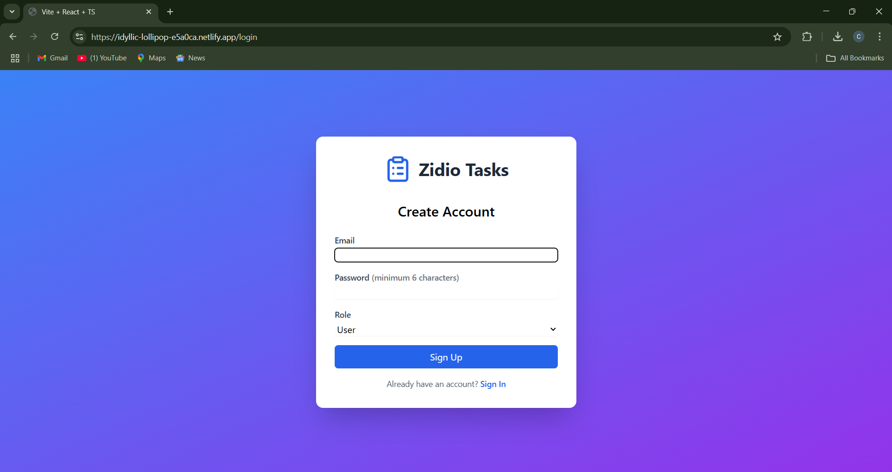
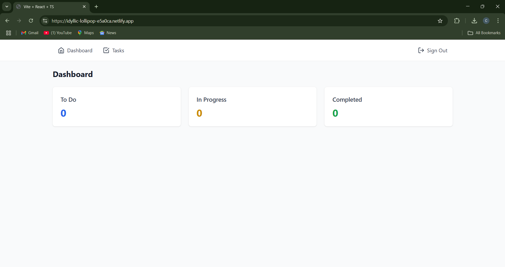
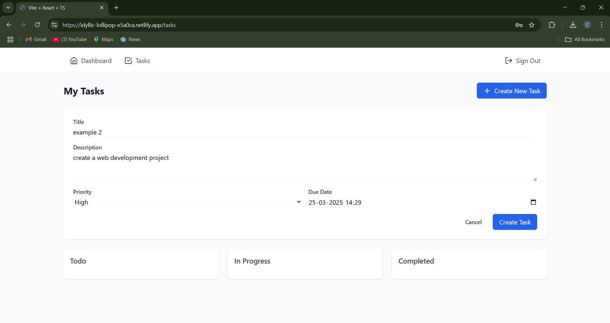
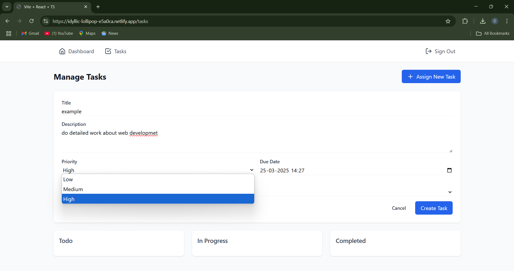
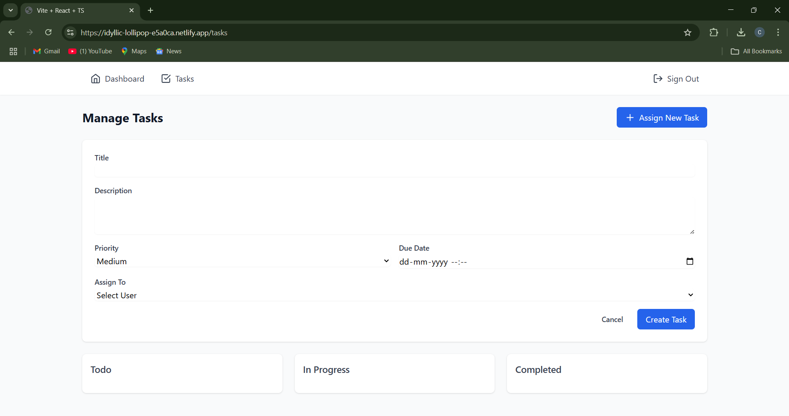
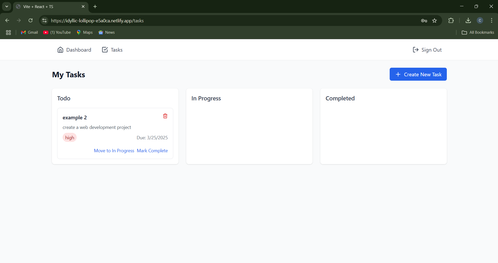
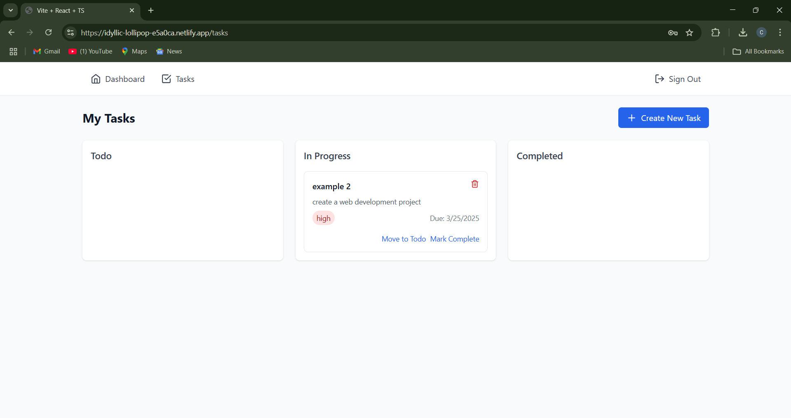
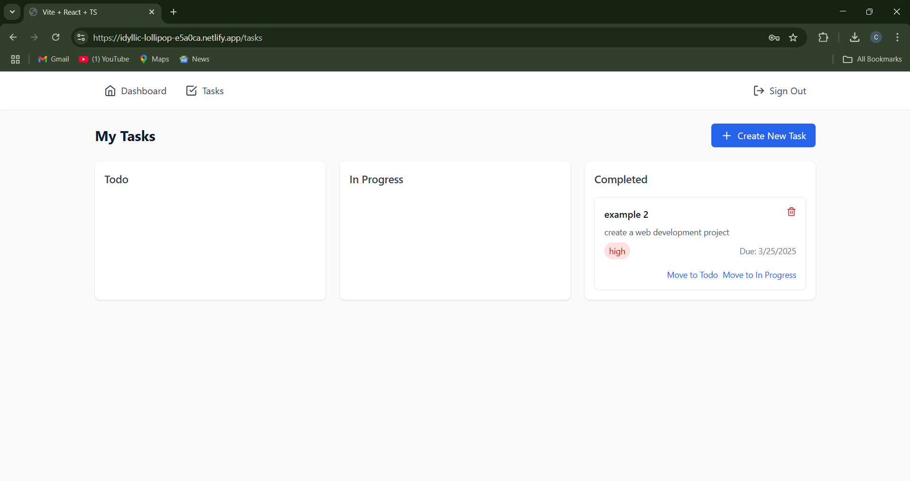
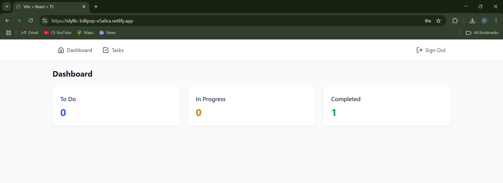

# Task Management System (Zidio)

This project is a Task Management System built using React.js for the frontend. Follow the steps below to deploy it on your local computer.

## 🚀 Features
- Task creation, tracking, and management
- Progress tracking
- User authentication (if applicable)
- Responsive UI

## 🛠️ Installation Steps

### **1. Clone the repository**
```sh
git clone https://github.com/Chaitu1017/Zidio-Task-Management.git
cd Zidio-Task-Management
```

### **2. Install Dependencies**
```sh
npm install
```

### **3. Start the Development Server**
```sh
npm run dev
```

## 📸 Screenshots

### **1.LOGIN**


### **2.CREATE ACCOUNT**


### **3.DASHBOARD**


### **4.USER CREATE**


### **5.Task Priority**


### **6.ADMIN TASK ASSIGNMENT**


### **7.TODO TASKS**


### **8.IN PROGRESS**


### **9.COMPLETED TASK**


### **10.DASHBOARD UPDATE**



---
